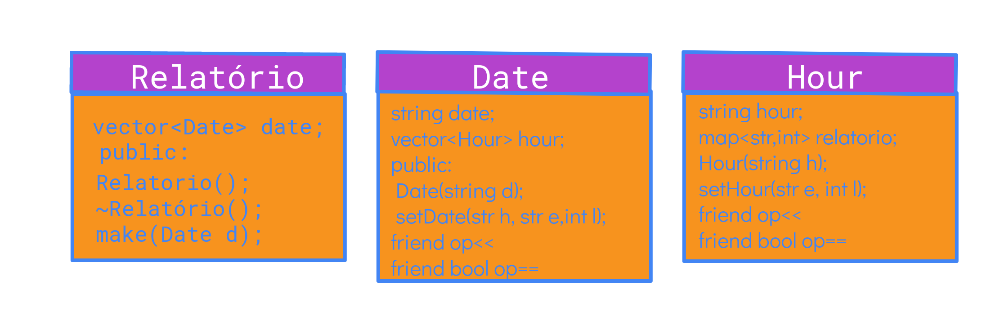

# Gerador de Relatório de Eventos

Os eventos devem conter data, hora e descrição do evento

Também deve ser possível buscar por um evento entre os existentes e acessá-lo para visualizar seus dados

